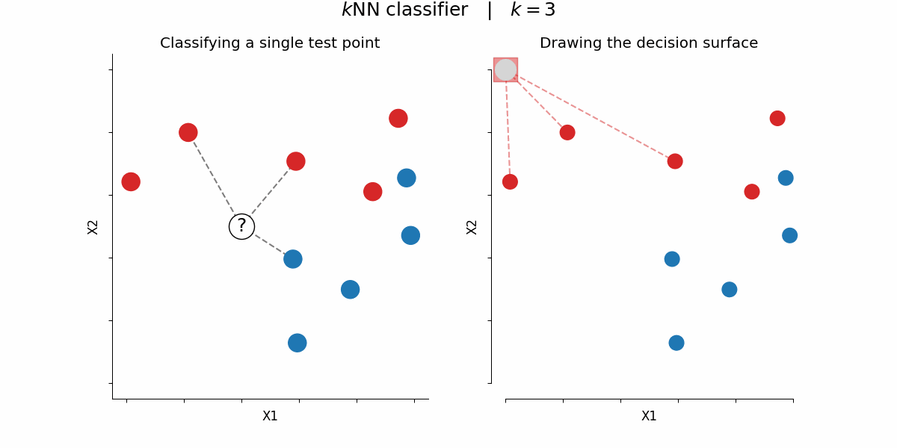

<!-- `made by` Arya Gupta -->
---
title: K Nearest Neighbour
subtitle: This is the most basic and overlooked in today's machine learning world, when we have advanced stuff, like transformers, RNNs and so much more. But in reality, if you dive deep into any kind of model, it will have linear regression in some form or the other!
author: Arya Gupta
---

# K-Nearest Neighbors (KNN) Algorithm

**Subtitle**: Among the most straightforward yet effective machine learning algorithms! KNN stands out for its intuitiveness, as it doesn’t need a dedicated training step and is versatile enough for both classification and regression challenges. At its core, KNN operates on the idea that data points resembling each other will be found close together—making it an excellent choice for grasping the basics of machine learning.

**Author**: Arya Gupta

---


## What is K-Nearest Neighbors?

K-Nearest Neighbors (KNN) is a **non-parametric**, **supervised learning** algorithm that can be used for both classification and regression tasks. The fundamental idea is beautifully simple: to predict the class or value of a new data point, look at the 'k' closest points in the training data and make a decision based on them.

### Core Principle

The algorithm is based on the assumption that similar data points are likely to belong to the same class or have similar values. This is often summarized as:

> **"Tell me who your neighbors are, and I'll tell you who you are"**

### Mathematical Foundation

For a new data point **x**, KNN finds the k nearest neighbors from the training set and makes predictions as follows:

**For Classification:**
$$
\hat{y} = \text{mode}(\{y_i : x_i \in N_k(x)\})
$$

**For Regression:**
$$
\hat{y} = \frac{1}{k} \sum_{x_i \in N_k(x)} y_i
$$

Where:
- $N_k(x)$ represents the set of k nearest neighbors to point x
- $y_i$ is the label/value of the i-th neighbor
- $\hat{y}$ is the predicted class/value

## How KNN Works: Step-by-Step

Let's understand KNN through a practical example. Imagine we want to classify whether a new student will pass or fail based on their study hours and sleep hours.

### Step 1: Calculate Distances

For each training point, calculate the distance to the new point. The most common distance metrics are:

**Euclidean Distance (Most Common):**
$$
d(x_i, x_j) = \sqrt{\sum_{k=1}^{n} (x_{ik} - x_{jk})^2}
$$

**Manhattan Distance:**
$$
d(x_i, x_j) = \sum_{k=1}^{n} |x_{ik} - x_{jk}|
$$

**Minkowski Distance (Generalized):**
$$
d(x_i, x_j) = \left(\sum_{k=1}^{n} |x_{ik} - x_{jk}|^p\right)^{1/p}
$$

### Step 2: Find K Nearest Neighbors

Sort all distances and select the k smallest ones. These correspond to the k nearest neighbors.

### Step 3: Make Prediction

- **Classification**: Use majority voting among the k neighbors
- **Regression**: Take the average of the k neighbors' values

## The Critical Parameter: Choosing K

The choice of k is crucial and significantly impacts the model's performance:


### Impact of K Values

**Small K (k=1, k=3):**
- **Pros**: Captures local patterns well, low bias
- **Cons**: High variance, sensitive to noise, overfitting
- **Use Case**: When you have clean data with clear local patterns

**Large K (k=20, k=50):**
- **Pros**: Smoother decision boundaries, less sensitive to noise
- **Cons**: May miss local patterns, underfitting, high bias
- **Use Case**: When data is noisy or you want more generalized decisions



### Methods to Choose Optimal K

#### 1. Elbow Method
Plot the validation error for different k values and look for the "elbow point":

```python
import numpy as np
import matplotlib.pyplot as plt
from sklearn.model_selection import cross_val_score
from sklearn.neighbors import KNeighborsClassifier

def find_optimal_k(X_train, y_train, max_k=20):
    k_values = range(1, max_k + 1)
    cv_scores = []
    
    for k in k_values:
        knn = KNeighborsClassifier(n_neighbors=k)
        scores = cross_val_score(knn, X_train, y_train, cv=5, scoring='accuracy')
        cv_scores.append(scores.mean())
    
    plt.figure(figsize=(10, 6))
    plt.plot(k_values, cv_scores, marker='o')
    plt.xlabel('Number of Neighbors (k)')
    plt.ylabel('Cross-Validation Accuracy')
    plt.title('Elbow Method for Optimal k')
    plt.grid(True)
    plt.show()
    
    optimal_k = k_values[np.argmax(cv_scores)]
    return optimal_k, cv_scores
```

#### 2. Grid Search with Cross-Validation

```python
from sklearn.model_selection import GridSearchCV

def grid_search_k(X_train, y_train):
    param_grid = {'n_neighbors': range(1, 31)}
    knn = KNeighborsClassifier()
    
    grid_search = GridSearchCV(knn, param_grid, cv=5, scoring='accuracy')
    grid_search.fit(X_train, y_train)
    
    return grid_search.best_params_['n_neighbors']
```

## Distance Metrics in Detail

The choice of distance metric can significantly impact KNN performance:

### When to Use Each Metric

**Euclidean Distance:**
- **Best for**: Continuous features, when all features are equally important
- **Assumes**: Features are on similar scales

**Manhattan Distance:**
- **Best for**: When features have different units or scales
- **Robust to**: Outliers (compared to Euclidean)

**Minkowski Distance:**
- **Flexibility**: Can adjust p parameter (p=1 gives Manhattan, p=2 gives Euclidean)
- **Use Case**: When you want to experiment with different distance sensitivities

### Implementation of Distance Metrics

```python
import numpy as np

def euclidean_distance(point1, point2):
    return np.sqrt(np.sum((point1 - point2) ** 2))

def manhattan_distance(point1, point2):
    return np.sum(np.abs(point1 - point2))

def minkowski_distance(point1, point2, p=2):
    return np.sum(np.abs(point1 - point2) ** p) ** (1/p)
```

## Data Preprocessing for KNN

### Feature Scaling: Critical for KNN

KNN is highly sensitive to the scale of features. Consider this example:
- Feature 1: Age (range 20-80)
- Feature 2: Income (range 20,000-100,000)

Without scaling, income will dominate the distance calculation!

```python
from sklearn.preprocessing import StandardScaler, MinMaxScaler

# Standardization (Zero mean, unit variance)
def standardize_features(X_train, X_test):
    scaler = StandardScaler()
    X_train_scaled = scaler.fit_transform(X_train)
    X_test_scaled = scaler.transform(X_test)
    return X_train_scaled, X_test_scaled

# Min-Max Normalization (0 to 1 range)
def normalize_features(X_train, X_test):
    scaler = MinMaxScaler()
    X_train_scaled = scaler.fit_transform(X_train)
    X_test_scaled = scaler.transform(X_test)
    return X_train_scaled, X_test_scaled
```

### Handling the Curse of Dimensionality

As the number of dimensions increases, the distance between any two points becomes similar, making KNN less effective.

**Dimensionality Reduction with PCA:**

```python
from sklearn.decomposition import PCA

def reduce_dimensions(X_train, X_test, n_components=0.95):
    pca = PCA(n_components=n_components)  # Keep 95% of variance
    X_train_reduced = pca.fit_transform(X_train)
    X_test_reduced = pca.transform(X_test)
    return X_train_reduced, X_test_reduced, pca
```

## Complete KNN Implementation from Scratch

```python
import numpy as np
from collections import Counter

class KNearestNeighbors:
    def __init__(self, k=3, distance_metric='euclidean'):
        self.k = k
        self.distance_metric = distance_metric
        
    def fit(self, X, y):
        """Store training data (lazy learning)"""
        self.X_train = X
        self.y_train = y
        
    def _calculate_distance(self, point1, point2):
        """Calculate distance between two points"""
        if self.distance_metric == 'euclidean':
            return np.sqrt(np.sum((point1 - point2) ** 2))
        elif self.distance_metric == 'manhattan':
            return np.sum(np.abs(point1 - point2))
        else:
            raise ValueError("Distance metric not supported")
    
    def _get_neighbors(self, test_point):
        """Find k nearest neighbors"""
        distances = []
        for i, train_point in enumerate(self.X_train):
            dist = self._calculate_distance(test_point, train_point)
            distances.append((dist, i))
        
        # Sort by distance and get k nearest
        distances.sort(key=lambda x: x[0])
        neighbors = [distances[i][1] for i in range(self.k)]
        return neighbors
    
    def predict_classification(self, X_test):
        """Predict classes for test data"""
        predictions = []
        for test_point in X_test:
            neighbors = self._get_neighbors(test_point)
            neighbor_labels = [self.y_train[i] for i in neighbors]
            # Majority vote
            prediction = Counter(neighbor_labels).most_common(1)[0][0]
            predictions.append(prediction)
        return np.array(predictions)
    
    def predict_regression(self, X_test):
        """Predict values for regression"""
        predictions = []
        for test_point in X_test:
            neighbors = self._get_neighbors(test_point)
            neighbor_values = [self.y_train[i] for i in neighbors]
            # Average of neighbor values
            prediction = np.mean(neighbor_values)
            predictions.append(prediction)
        return np.array(predictions)
```

## Using Scikit-learn Implementation

```python
from sklearn.neighbors import KNeighborsClassifier, KNeighborsRegressor
from sklearn.model_selection import train_test_split
from sklearn.metrics import accuracy_score, mean_squared_error
from sklearn.preprocessing import StandardScaler

# Classification Example
def knn_classification_example(X, y):
    # Split the data
    X_train, X_test, y_train, y_test = train_test_split(X, y, test_size=0.2, random_state=42)
    
    # Scale the features
    scaler = StandardScaler()
    X_train_scaled = scaler.fit_transform(X_train)
    X_test_scaled = scaler.transform(X_test)
    
    # Create and train KNN classifier
    knn = KNeighborsClassifier(n_neighbors=5)
    knn.fit(X_train_scaled, y_train)
    
    # Make predictions
    y_pred = knn.predict(X_test_scaled)
    
    # Evaluate
    accuracy = accuracy_score(y_test, y_pred)
    print(f"Accuracy: {accuracy:.4f}")
    
    return knn, scaler

# Regression Example
def knn_regression_example(X, y):
    # Split the data
    X_train, X_test, y_train, y_test = train_test_split(X, y, test_size=0.2, random_state=42)
    
    # Scale the features
    scaler = StandardScaler()
    X_train_scaled = scaler.fit_transform(X_train)
    X_test_scaled = scaler.transform(X_test)
    
    # Create and train KNN regressor
    knn = KNeighborsRegressor(n_neighbors=5)
    knn.fit(X_train_scaled, y_train)
    
    # Make predictions
    y_pred = knn.predict(X_test_scaled)
    
    # Evaluate
    mse = mean_squared_error(y_test, y_pred)
    print(f"Mean Squared Error: {mse:.4f}")
    
    return knn, scaler
```

## Advanced Optimizations

### 1. Weighted KNN

Give more importance to closer neighbors:

```python
from sklearn.neighbors import KNeighborsClassifier

# Distance-based weighting
knn_weighted = KNeighborsClassifier(n_neighbors=5, weights='distance')

# Custom weight function
def custom_weights(distances):
    return 1 / (distances + 1e-8)

knn_custom = KNeighborsClassifier(n_neighbors=5, weights=custom_weights)
```

### 2. Efficient Neighbor Search

For large datasets, use tree-based algorithms:

```python
# Using Ball Tree for efficiency
knn_ball_tree = KNeighborsClassifier(
    n_neighbors=5, 
    algorithm='ball_tree',
    leaf_size=30
)

# Using KD Tree (good for low dimensions)
knn_kd_tree = KNeighborsClassifier(
    n_neighbors=5, 
    algorithm='kd_tree',
    leaf_size=30
)
```

### 3. Cross-Validation for Model Selection

```python
from sklearn.model_selection import cross_val_score

def evaluate_knn_cv(X, y, k_values):
    results = {}
    for k in k_values:
        knn = KNeighborsClassifier(n_neighbors=k)
        scores = cross_val_score(knn, X, y, cv=5, scoring='accuracy')
        results[k] = {
            'mean_score': scores.mean(),
            'std_score': scores.std()
        }
    return results
```

## Real-World Applications

### 1. Image Classification

```python
# Example: Classifying handwritten digits
from sklearn.datasets import load_digits
from sklearn.neighbors import KNeighborsClassifier

# Load digit dataset
digits = load_digits()
X, y = digits.data, digits.target

# Apply KNN
knn = KNeighborsClassifier(n_neighbors=3)
# ... training and evaluation code
```

### 2. Recommendation Systems

```python
# Collaborative Filtering with KNN
def recommend_items(user_item_matrix, user_id, k=5):
    # Find k most similar users
    user_similarities = []
    target_user = user_item_matrix[user_id]
    
    for i, other_user in enumerate(user_item_matrix):
        if i != user_id:
            similarity = cosine_similarity([target_user], [other_user])[0][0]
            user_similarities.append((similarity, i))
    
    # Get top k similar users
    similar_users = sorted(user_similarities, reverse=True)[:k]
    
    # Recommend items based on similar users
    recommendations = []
    # ... recommendation logic
    
    return recommendations
```

### 3. Anomaly Detection

```python
# Using KNN for outlier detection
from sklearn.neighbors import LocalOutlierFactor

def detect_anomalies(X, contamination=0.1):
    lof = LocalOutlierFactor(n_neighbors=5, contamination=contamination)
    outliers = lof.fit_predict(X)
    return outliers  # -1 for outliers, 1 for inliers
```

## Model Evaluation and Validation

### Classification Metrics

```python
from sklearn.metrics import classification_report, confusion_matrix

def evaluate_knn_classifier(y_true, y_pred):
    print("Classification Report:")
    print(classification_report(y_true, y_pred))
    
    print("\nConfusion Matrix:")
    print(confusion_matrix(y_true, y_pred))
```

### Regression Metrics

```python
from sklearn.metrics import mean_squared_error, r2_score, mean_absolute_error

def evaluate_knn_regressor(y_true, y_pred):
    mse = mean_squared_error(y_true, y_pred)
    rmse = np.sqrt(mse)
    mae = mean_absolute_error(y_true, y_pred)
    r2 = r2_score(y_true, y_pred)
    
    print(f"MSE: {mse:.4f}")
    print(f"RMSE: {rmse:.4f}")
    print(f"MAE: {mae:.4f}")
    print(f"R²: {r2:.4f}")
```

## Advantages and Limitations

### Advantages 

1. **Simple and Intuitive**: Easy to understand and implement
2. **No Training Period**: Lazy learning approach
3. **Versatile**: Works for both classification and regression
4. **No Assumptions**: Non-parametric, doesn't assume data distribution
5. **Naturally Multi-class**: Handles multiple classes without modification
6. **Adapts to Data**: Performance improves with more data

### Limitations 

1. **Computationally Expensive**: O(n) time complexity for each prediction
2. **Memory Intensive**: Stores entire training dataset
3. **Sensitive to Irrelevant Features**: Curse of dimensionality
4. **Sensitive to Scale**: Requires feature scaling
5. **Poor Performance with Imbalanced Data**: Majority class dominates
6. **Sensitive to Local Structure**: Can be affected by noise

## Best Practices and Tips

### 1. Data Preprocessing Checklist
- Scale your features (StandardScaler or MinMaxScaler)
- Handle missing values
- Remove or transform outliers
- Consider dimensionality reduction for high-dimensional data

### 2. Hyperparameter Tuning
- Use cross-validation to find optimal k
- Experiment with different distance metrics
- Consider weighted voting for better performance
- Try different algorithms (brute, ball_tree, kd_tree) for efficiency

### 3. Model Validation
- Use stratified sampling for imbalanced datasets
- Perform cross-validation
- Monitor both training and validation performance
- Use appropriate evaluation metrics for your problem

## Conclusion

K-Nearest Neighbors is a fundamental algorithm that serves as an excellent introduction to machine learning concepts. Its simplicity and effectiveness make it a valuable tool in any data scientist's toolkit. While it has limitations with large datasets and high-dimensional data, proper preprocessing and parameter tuning can make KNN highly effective for many real-world problems.

The key to success with KNN lies in:
- Choosing the right value of k
- Proper feature scaling and preprocessing
- Selecting appropriate distance metrics
- Understanding when to use it vs. other algorithms

---